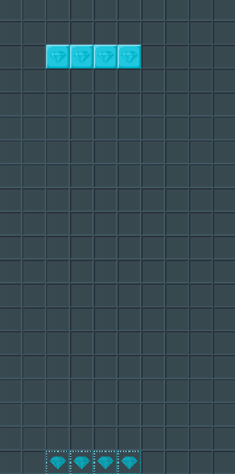

# Unity_Tetris

Este repositorio contiene todos los archivos de un clon del Tetris hecho en Unity.

Este proyecto muestra una versión simple del juego Tetris.

La versión de Unity del proyecto es 2020.3.11f1

## Controles

**Movimiento Horizontal**: Para el movimiento horizontal de las piezas, se usan las teclas "A" y "D".

**Rotar Pieza**: Para rotar una pieza hacia, la izquierda o a la derecha, se usan las respectivas flechas del teclado "&larr;" y "&rarr;"

**Bajar Rapidamente/Instantaneamente una Pieza**: Para aumentar la velocidad a la que baja una pieza, se usa la tecla "S" (Bajara rápido solo al mantener pulsada la tecla). Para hacer que baje Instantaneamente, y se coloque ya en su sitio, se usa la tecla "W".

**Guardar Pieza**: Para guardar una pieza en el banco de piezas, se usa la "Barra Espaciadora". Solo puede haber una pieza a la vez, por lo que si ya hay una pieza guardada, se sustituye con la que se este jugando en ese instante.

**Salir del Juego**: Para salir del juego simplemente pulsa "ESC".
